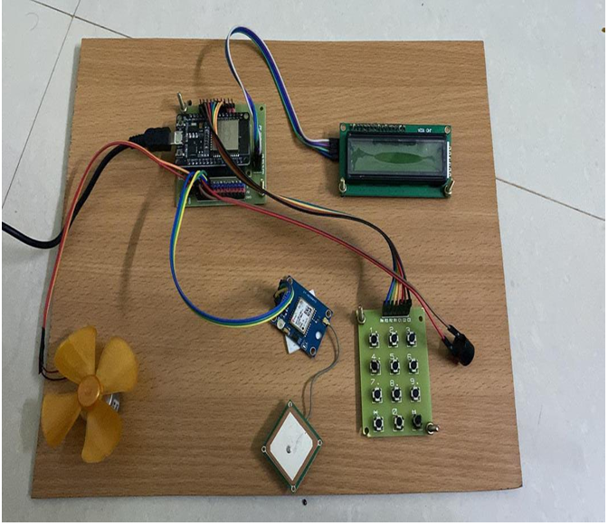
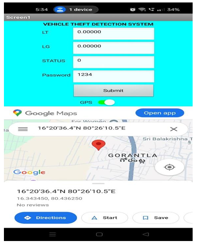
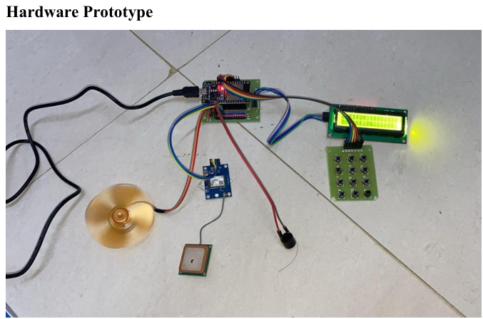

# 🚗 IgniSecure – Smart Vehicle Immobilizer & Theft Alert System

<p align="center">


</p>

---

## 📖 Project Overview

**IgniSecure** is an IoT-based vehicle security system designed to prevent unauthorized vehicle access using password authentication, GPS tracking, cloud monitoring, and remote vehicle control.

The system combines **ESP32**, **GPS Module**, **ThingSpeak Cloud**, and **Embedded Programming** to provide an affordable and efficient anti-theft solution.

---

# ✨ Key Features

- 🔐 Password-based Vehicle Authentication
- 🚗 Vehicle Immobilizer
- 📍 Live GPS Tracking
- ☁️ ThingSpeak Cloud Integration
- 🌐 Wi-Fi Connectivity
- 🚨 Buzzer Alert for Unauthorized Access
- 📺 LCD Display for Vehicle Status
- 📲 Remote Vehicle Monitoring
- ⚡ Low-Cost IoT Prototype

---

# 🛠 Hardware Components

| Component | Purpose |
|-----------|---------|
| ESP32 | Main Controller |
| Neo-6M GPS Module | Live Vehicle Tracking |
| 16x2 LCD Display | Displays System Status |
| 4x3 Matrix Keypad | Password Input |
| Relay Module | Controls Vehicle Motor |
| DC Motor | Vehicle Prototype |
| Active Buzzer | Theft Alert |
| Breadboard & Jumper Wires | Circuit Connections |

---

# 💻 Software Used

- Arduino IDE
- ThingSpeak Cloud
- Google Maps
- Embedded C / Arduino Programming

---

# 📂 Project Structure

```text
IgniSecure-Smart-Vehicle-Immobilizer
│
├── Arduino_Code
│   ├── ignisecure.ino
│   ├── libraries.txt
│   └── connections.md
│
├── Components
│   └── components.md
│
├── Block_Diagram
│   └── block-diagram.png
│
├── Circuit_Diagram
│   └── circuit-diagram.png
│
├── Images
│   ├── hardware-prototype.png
│   ├── working-prototype.png
│   ├── gps-tracking.png
│   └── Images.md
│
└── README.md
```

# ⚙️ System Workflow

```
Power ON
     │
     ▼
Connect to Wi-Fi
     │
     ▼
Enter Password
     │
 ┌──────────────┐
 │ Correct?     │
 └──────┬───────┘
        │
  Yes   │    No
        ▼
Vehicle Starts
        │
GPS Updates Cloud
        │
Remote Monitoring
        │
Vehicle Control
```

---

# 📸 Project Preview

## 🔧 Hardware Prototype



---

## 📍 GPS Tracking



---

## 🚗 Working Prototype



---

# 🚀 Technologies Used

- ESP32
- Embedded C
- Arduino IDE
- IoT
- GPS Module
- ThingSpeak Cloud
- Wi-Fi
- LCD Display
- Keypad Authentication

---

# 🔮 Future Enhancements

- 📱 Mobile Application
- 📩 SMS Alerts
- 📷 Camera Integration
- ☁ Firebase Cloud Support
- 🤖 AI-Based Intrusion Detection
- 🔑 Fingerprint Authentication

---

# 🎯 Applications

- Personal Vehicle Security
- Smart Parking Systems
- Fleet Management
- College IoT Projects
- Smart Transportation
- Rural Vehicle Protection

---

# 👩‍💻 Author

**BAKKA RUPASRI**

B.Tech – Cybersecurity & IoT

GitHub: https://github.com/rupasribakka

LinkedIn: https://www.linkedin.com/in/rupasri-bakka-524234325/

---

## ⭐ If you found this project helpful, consider giving it a Star!
